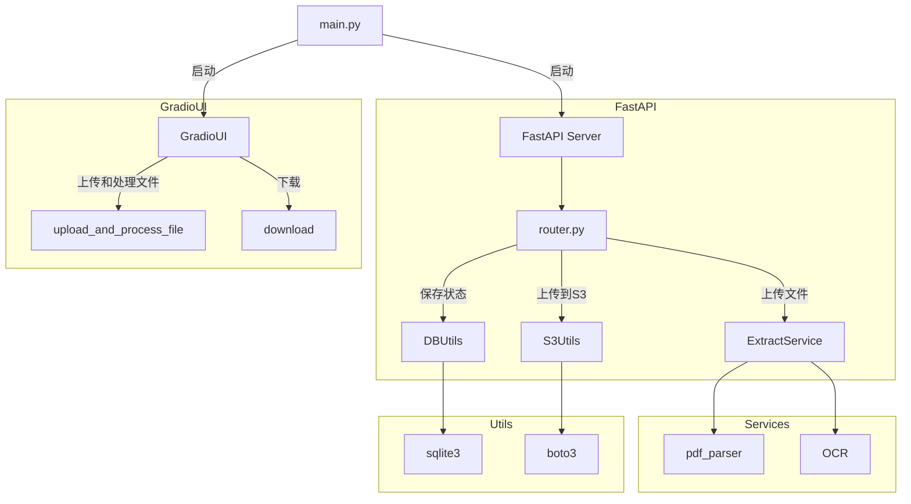

# Cloud-Native Data Processing Architecture

## Introduction

This document provides a detailed description of a cloud-native architecture designed and implemented for a logistics company. The primary requirement is to handle a large volume of unstructured data, including PDFs and images, extracting valuable content for the company's analytics team. The system needs to be scalable, highly available, and reliable to meet the company's growing demands.

## Architecture Overview

### Components

1. **FastAPI Server**: This server handles file upload and download requests and processes data.
2. **Gradio UI**: Provides a user interface for file uploads and result downloads.
3. **Service Layer**: Processes content extraction from PDFs and images using a combination of PDF parsing and OCR (Optical Character Recognition) technologies.
4. **Database**: Stores the status of file processing tasks, ensuring that the system can track and manage the workflow effectively.
5. **S3 Storage**: Used for storing processed files and intermediate results, enabling scalable and durable storage solutions.

### Workflow

1. **File Upload**: Users upload files through the Gradio UI, which sends the files to the FastAPI server.
2. **File Processing**:
    - **ZIP File Handling**: The FastAPI server checks if the uploaded file is a ZIP archive. If it is, the server extracts its contents.
    - **Single File Handling**: If the uploaded file is not a ZIP archive, it is processed directly.
3. **Content Extraction**:
    - **PDFs**: The service layer uses a PDF parser to extract text and tables from PDF files.
    - **Images**: The service layer uses OCR technology to extract text and tables from image files.
4. **Storing Results**: Extracted content (text and tables) is stored in S3, and the status of each processing task is recorded in the database.
5. **File Download**: Users can download the processed files through the Gradio UI by providing the task ID. The FastAPI server retrieves the processed files from S3 and serves them to the user.

### Key Considerations

- **Scalability**: The use of cloud-native services like S3 ensures that the system can handle increasing data volumes without performance degradation.
- **Reliability**: Storing processing status in a database helps in tracking and managing the workflow, ensuring that no file is left unprocessed.
- **User Interaction**: The Gradio UI provides an intuitive interface for users to upload files and download processed results, making the system user-friendly.
- **Support for ZIP Archives**: The ability to handle ZIP files containing multiple PDFs and images adds flexibility, allowing users to batch upload and process multiple files in one go.

### architecture diagram

## Conclusion

This architecture design combines FastAPI and Gradio to provide a flexible and scalable solution for processing large volumes of unstructured data. By using S3 for storage and a database for task management, the system ensures high availability and reliability. The added support for ZIP files containing PDFs and images enhances the system's capability, making it more versatile and efficient in meeting the logistics company's growing data processing needs.
